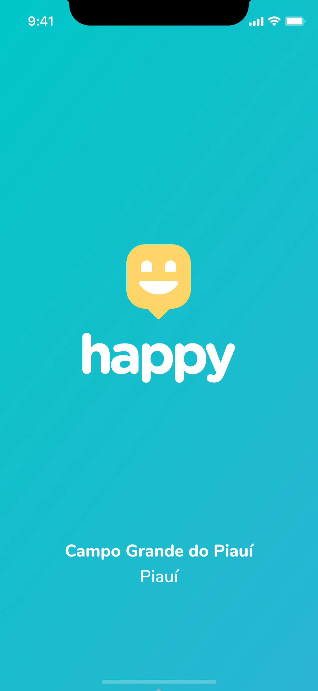

---
<h1 align="center">Happy :)</h1>

---

  
  

---

<h3 align="center">Leve felicidade para o mundo! Visite orfanatos e mude o dia de muitas crianças :smiley::girl::boy:</h3>

---

  
  
  

---

## :smiley: Sobre o projeto

  <b>Happy</b> é uma aplicação proposta pela <a href="https://github.com/Rocketseat">RocketSeat :rocket:</a> na 3ª edição da Next Level Week (NLW). O projeto tem como objetivo reunir dados de orfanatos de uma cidade a fim de que pessoas interessadas em visitá-los possam encontrá-los facilmente. Através da aplicação web ou mobile, os orfanatos podem cadastrar seus dados e as pessoas podem visualizar no mapa onde eles estão localizados.

---

## :rocket: Tecnologias utilizadas

Foram utilizadas as seguintes tecnologias no desenvolvimento do projeto:

- [Node.js](https://nodejs.org/en/)
- [React](https://reactjs.org)
- [React Native](https://facebook.github.io/react-native/)
- [React Leaflet](https://react-leaflet.js.org/)
- [React Router](https://reactrouter.com/web/guides/quick-start)
- [React Icons](https://react-icons.github.io/react-icons/)
- [Expo](https://expo.io/)
- [TypeScript](https://www.typescriptlang.org/)
- [Express](https://expressjs.com/pt-br/)
- [Axios](https://www.npmjs.com/package/axios)
- [Cors](https://www.npmjs.com/package/cors)

---

## 🔖 Layout

Nos links abaixo você encontra o layout do projeto web e também do mobile. Lembrando que você precisa ter uma conta no [Figma](http://figma.com/) para acessá-lo.

- [Layout Web](https://www.figma.com/file/mDEbnoojksG4w8sOxmudh3/Happy-Web)
- [Layout Mobile](https://www.figma.com/file/X27FfVxAgy9f5IFa7ONlph/Happy-Mobile)

---

## :computer: Execução da aplicação

### Para executar o backend:

### Para executar o frontend:

### Para executar o mobile:

- Entre na pasta raíz do projeto e navegue para o diretório da aplicação mobile usando `cd mobile`;
- Instale as dependências usando `npm install`;
- Execute o expo usando `expo start`;
- Você pode executar o app em um emulador ou em um dispositivo físico:
  - No caso do emulador, inicie o emulador desejado (Android ou iOS), depois clique em `Run on Android emulator` ou `Run on iOS simulator`, dependendo da opção desejada;
  - No caso do dispositivo físico, instale o app Expo através da loja de aplicativos, e escaneie o QR code.
  
---

## :muscle: Como contribuir

- Faça um fork desse repositório;
- Cria uma branch com a sua feature: `git checkout -b minha-feature`;
- Faça commit das suas alterações: `git commit -m 'feat: Minha nova feature'`;
- Faça push para a sua branch: `git push origin minha-feature`.

---

## :memo: Licença

Esse projeto está sob a licença MIT. Veja o arquivo [LICENSE](https://github.com/VitoriaCarvalho/NLW-3-Happy/blob/master/LICENSE) para mais detalhes.

---

Desenvolvido por <a href="https://www.linkedin.com/in/vit%C3%B3ria-carvalho-90210b19a/">Vitória Carvalho :woman::computer:</a>

---

